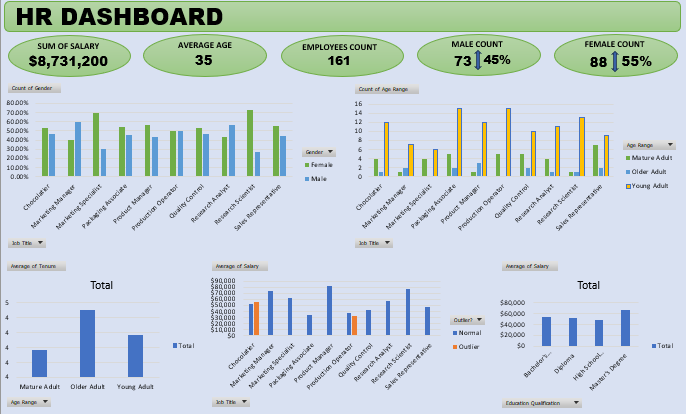

# HR Analytics Dashboard: Workforce, Diversity & Compensation Insights (2017–2023)

This project analyzes internal HR data to provide insights into employee demographics, workforce structure, compensation patterns, and diversity trends. Built in Microsoft Excel, this interactive dashboard helps HR leadership make data-driven decisions for strategic planning and policy improvements.

---

## Executive Summary

**Objective:**  
To understand employee demographics, salary trends, and workforce structure using key HR metrics.

**Key Insights:**
- Technical and production roles are male-dominated, while sales roles are predominantly female.
- Older employees tend to have longer tenure, suggesting stronger job stability.
- Education level impacts salary moderately; PhD holders earn slightly more.
- Leadership roles command higher average salaries and have older age distributions.

**Recommendations:**
- Promote gender diversity in technical roles through inclusive hiring.
- Develop career programs focused on younger employees to improve retention.
- Investigate salary outliers to ensure fairness and compliance in pay practices.

---

## Business Context

**Background:**  
HR leadership is assessing workforce structure and pay trends to guide future strategies for diversity, retention, and compensation equity.

**Stakeholders:**  
HR Department, Department Heads, and Executive Leadership.

**Key Business Questions:**
- Are specific roles dominated by a single gender?
- Does education level influence salary?
- What is the age distribution across roles?
- Is there a correlation between age and tenure?
- Are there any salary outliers or anomalies?

---

## Data Overview

- **Source:** Internal HR database  
- **Date Range:** 2017 – 2023  
- **Fields Used:** Name, Job Title, Age, Gender, Education Qualification, Salary  
- **Data Notes:**  
   Assumes all entries are current and complete. Outlier detection was performed using built-in Excel dashboard logic.

---

## Dashboard Overview
> 

**Tool Used:** Microsoft Excel

### Key Visualizations:
- **Gender Distribution by Job Title:** Identifies gender-dominated roles
- **Age Range by Job Title:** Highlights hiring trends and retention by age group
- **Average Salary by Education Level:** Shows how salary varies with education
- **Tenure by Age Group:** Reveals retention patterns across age brackets
- **Salary Range with Outliers:** Flags potential anomalies for further review

## Strategic Recommendations

- Promote technical and production roles to women via targeted recruitment campaigns.
- Invest in mentoring and growth programs aimed at younger employees.
- Conduct a review of departments with extreme salary outliers to enforce fair pay practices.

---

## Skills Demonstrated

- Microsoft Excel: PivotTables, Data Visualization, Conditional Formatting
- HR Metrics Analysis
- Workforce Diversity Reporting
- Compensation Benchmarking
- Insight Communication

---

## Files

- `HR_Analytics_Report_2017_2023.pdf` – Executive summary and visualizations
---

## About Me

**Oluwatobi Titilayo**  
Data Analyst | Excel • SQL • Python • Power BI  
[LinkedIn](https://www.linkedin.com/in/titilayo-oluwatobi/) | [GitHub](https://github.com/Oluwatobi-Data)

---

> _“In God we trust. All others must bring data.” – W. Edwards Deming_
